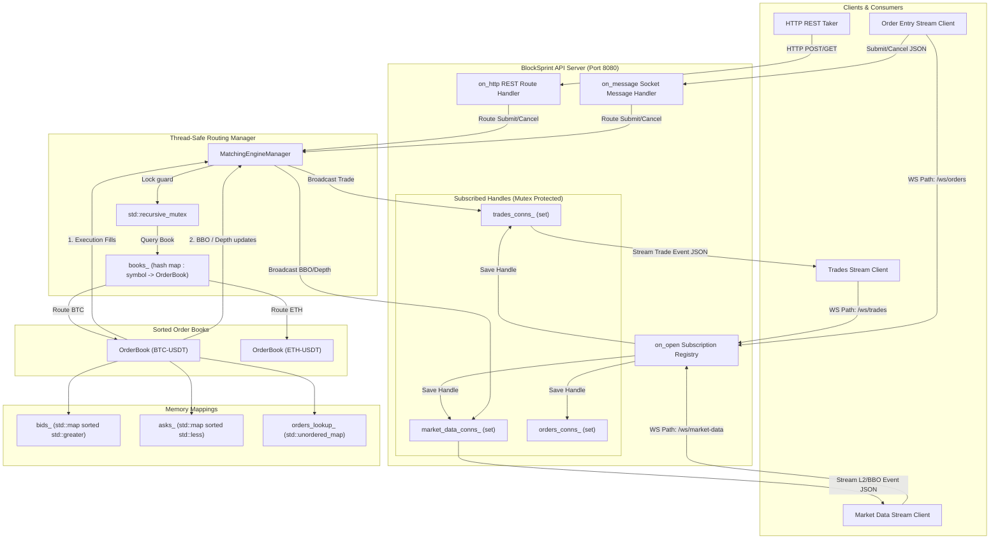

# BlockSprint - A Crypto Trading Matching Engine

BlockSprint is an ultra-high-performance cryptocurrency matching engine built in modern **C++17**. It implements core trading execution rules based on REG NMS (National Market System)-inspired principles of strict **Price-Time Priority (FIFO)** and **Internal Order Protection**, coupled with a low-latency network API supporting REST HTTP requests and multi-feed WebSocket subscriptions.

---

## 1. Project Features & Invariants

* **Price-Time Priority (FIFO)**: Orders are matched based on the best available price. For orders placed at the exact same price level, fills are allocated sequentially based on their time of arrival.
* **Internal Order Protection (Anti-Trade-Through)**: Restricts incoming marketable orders (Market or crossing Limit orders) from skipping price levels. The engine sweeps the book starting at the absolute best bids/asks, securing the best execution price for takers.
* **$O(1)$ Order Cancellations**: By storing a back-pointer double-linked list iterator inside the `Order` struct upon book entry, cancellations are retrieved via a hash map and erased from the price queue list in **$O(1)$ time**, bypassing expensive linear list scans or lazy deletion delays.
* **Supported Order Types**:
  - **Limit**: Rests on the book if not immediately marketable; executed at the limit price or better.
  - **Market**: Executes immediately against resting liquidity; unfilled volume is cancelled.
  - **IOC (Immediate Or Cancel)**: Fills as much volume as possible immediately up to the limit price; the unfilled remainder is cancelled.
  - **FOK (Fill Or Kill)**: Performs a pre-flight dry-run check. If the book cannot satisfy the *entire* order size at the limit price or better, the order is killed instantly without generating trades.
* **Thread-Safe Routing Manager**: Manages multiple symbol books (e.g. `BTC-USDT`, `ETH-USDT`) concurrently using a thread-safe registry with automatic book instantiation.
* **Asynchronous Multi-Feed API Server**: Provides REST JSON endpoints for order submissions and queries, alongside WebSocket feeds classifying clients into dedicated channels for market data streams (BBO & top 10 L2 depth), trade streams, and bi-directional order entries.
* **File-Based Logging Architecture**: Thread-safely redirects logs to local log files under the `logs/` directory, resolving timestamps to system local timezone.

---

## 2. Conceptual System Architecture

The following diagram illustrates how clients, HTTP/WS network handlers, the thread-safe router, and the sorted order books coordinate execution flow:



---

## 3. Libraries Required

BlockSprint is built using only header-only libraries, which are **cached locally** under the `external/` directory. This guarantees that you can build the project offline without setting up any package managers.

1. **[nlohmann/json](file:///c:/Users/Lenovo/Desktop/Crypto_Trading_Engine/external/nlohmann/json.hpp)** (v3.11.3): Used for high-speed parsing of incoming API bodies and formatting streamed events.
2. **[asio](file:///c:/Users/Lenovo/Desktop/Crypto_Trading_Engine/external/asio)** (v1.30.2): Standalone, header-only networking library providing low-level asynchronous TCP sockets without requiring Boost.
3. **[websocketpp](file:///c:/Users/Lenovo/Desktop/Crypto_Trading_Engine/external/websocketpp)** (v0.8.2): Header-only WebSocket server framework built on top of Asio.

---

## 4. Compilation & Running Guide

### System Requirements
* **Compiler**: Visual Studio 2022 with MSVC (support for C++17).
* **Build tool**: CMake (version 3.15 or higher).
* **Scripting**: Python (version 3.12 or higher, along with `uv` or `pip`).

### Command Guide

Navigate to the project root directory and execute:

#### 1. Configure Build System
Detects compilers and generates build files:
```powershell
cmake -B build
```

#### 2. Compile Binaries
Compiles both the matching engine and unit tests in Release mode:
```powershell
cmake --build build --config Release
```
This generates:
- `build\Release\crypto_matching_engine.exe` (API & Engine Server)
- `build\Release\run_tests.exe` (Unit Test Suite)

#### 3. Run Unit Tests
Execute the verification tests before starting the server:
```powershell
.\build\Release\run_tests.exe
```
*Expected Output*: Test results are written to `logs/matching_engine.log`. If all tests pass, the console exits cleanly with code `0`.

#### 4. Run the Matching Engine Server
Launch the server to begin listening for client connections on Port `8080`:
```powershell
.\build\Release\crypto_matching_engine.exe
```

#### 5. Install Python Dependencies (Separate Terminal)
Open a new terminal at the root and install socket requirements:
```powershell
uv add websockets
# or standard pip:
pip install websockets
```

#### 6. Run the WebSocket Throughput Benchmark
Measures the end-to-end WebSocket order throughput under load:
```powershell
uv run scripts/perf_test.py
# or standard python:
python scripts/perf_test.py
```
*Expected Output*: Sends 5,000 orders. Detailed results (throughput, latency, matches) are logged inside `logs/perf_test.log`.

#### 7. Run the Client Integration Demo
Simulates real-world market updates, order placements, and execution updates:
```powershell
uv run scripts/client_demo.py
# or standard python:
python scripts/client_demo.py
```
*Expected Output*: Connects to market data and trade feeds, places orders, and outputs results to `logs/client_demo.log`.

---

## 5. Directory Layout

```
BlockSprint/
├── CMakeLists.txt            # Main CMake target rules
├── src/                      # C++ source code
│   ├── models.hpp            # Structs and JSON serializers
│   ├── logger.hpp            # Thread-safe local file logging
│   ├── order_book.hpp/.cpp   # Matching and queue structures
│   ├── matching_engine.hpp   # Dynamic registry and routing
│   ├── api_server.hpp/.cpp   # HTTP & WebSocket endpoints
│   └── main.cpp              # Entrypoint and signal wiring
├── tests/                    # Verification suites
│   ├── test_harness.hpp      # Lightweight test runner
│   └── main_test.cpp         # Invariant assertions
├── scripts/                  # Python load testing
│   ├── perf_test.py          # WebSocket benchmark client
│   └── client_demo.py        # REST/WebSocket integration demo
├── external/                 # Locally cached dependencies
│   ├── nlohmann/             # json.hpp
│   ├── asio/                 # Standalone Asio headers
│   └── websocketpp/          # WebSocket++ headers
├── logs/                     # Output directory for logs
│   ├── matching_engine.log   # System engine logs
│   ├── perf_test.log         # Benchmark outputs
│   └── client_demo.log       # Client execution outputs
└── README.md                 # Project README
```
