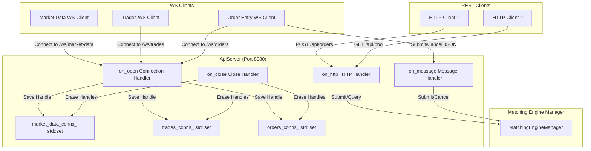

# File: src/api_server.hpp & src/api_server.cpp

This component implements the networking layer, hosting the HTTP REST endpoints and managing WebSocket clients subscribing to streaming feeds.

---

## What it Does

1. **Host REST Routes**: Runs on port `8080` (powered by WebSocket++ HTTP capabilities). It parses requests:
   - `POST /api/orders`: Reads the JSON body, parses side/qty/price, submits the order to `MatchingEngineManager`, and writes a `200 OK` response with the list of executions.
   - `DELETE /api/orders`: Cancels a resting order and returns `200 OK` on success.
   - `GET /api/bbo?symbol=BTC-USDT`: Returns the current Best Bid & Offer.
   - `GET /api/depth?symbol=BTC-USDT`: Returns the top 10 L2 bids and asks.
2. **Handles WebSocket Clients**:
   - Manages WebSocket endpoints based on the connection resource path:
     - `/ws/market-data`: Stream BBO and Depth updates.
     - `/ws/trades`: Stream execution reports.
     - `/ws/orders`: Stream for submitting or cancelling orders over sockets.
3. **CORS Options**: Implements `OPTIONS` pre-flight headers, enabling cross-origin browser testing.
4. **Subscriber Management**: Uses `std::set` to track active connection handles (`websocketpp::connection_hdl`). Separate sets are kept for `/ws/market-data`, `/ws/trades`, and `/ws/orders`.
5. **Broadcasting**:
   - Broadcasts JSON events to clients using `server_.send(hdl, payload)`.
   - Protects the connection sets using a `std::mutex` to ensure thread-safe insertion/removal when clients open or close connections concurrently.

---

## Architectural Diagram

The diagram below shows the server structure and client connection routing:



---

## Data Message Contracts

### 1. Market Data Feed (`/ws/market-data`)
The server streams L2 updates and BBOs as they occur.
* **BBO Format**:
  ```json
  {
    "event": "bbo",
    "symbol": "BTC-USDT",
    "data": {
      "symbol": "BTC-USDT",
      "timestamp": "2026-06-28T16:29:21.083418Z",
      "bid_price": "100.000000",
      "bid_qty": "1.380000",
      "ask_price": "100.230000",
      "ask_qty": "1.480000"
    }
  }
  ```
* **L2 Depth Format** (Top 10 levels):
  ```json
  {
    "event": "depth",
    "symbol": "BTC-USDT",
    "data": {
      "symbol": "BTC-USDT",
      "timestamp": "2026-06-28T16:29:21.083696Z",
      "bids": [
        ["100.000000", "1.380000"],
        ["99.750000", "5.940000"]
      ],
      "asks": [
        ["100.230000", "1.480000"],
        ["100.820000", "8.420000"]
      ]
    }
  }
  ```

### 2. Trades Feed (`/ws/trades`)
The server streams execution fills.
* **Format**:
  ```json
  {
    "event": "trade",
    "symbol": "BTC-USDT",
    "data": {
      "timestamp": "2026-06-28T16:29:22.103870Z",
      "symbol": "BTC-USDT",
      "trade_id": "3821",
      "price": "100.000000",
      "quantity": "1.380000",
      "aggressor_side": "sell",
      "maker_order_id": "1782628161082907900",
      "taker_order_id": "1782628162103695400"
    }
  }
  ```
