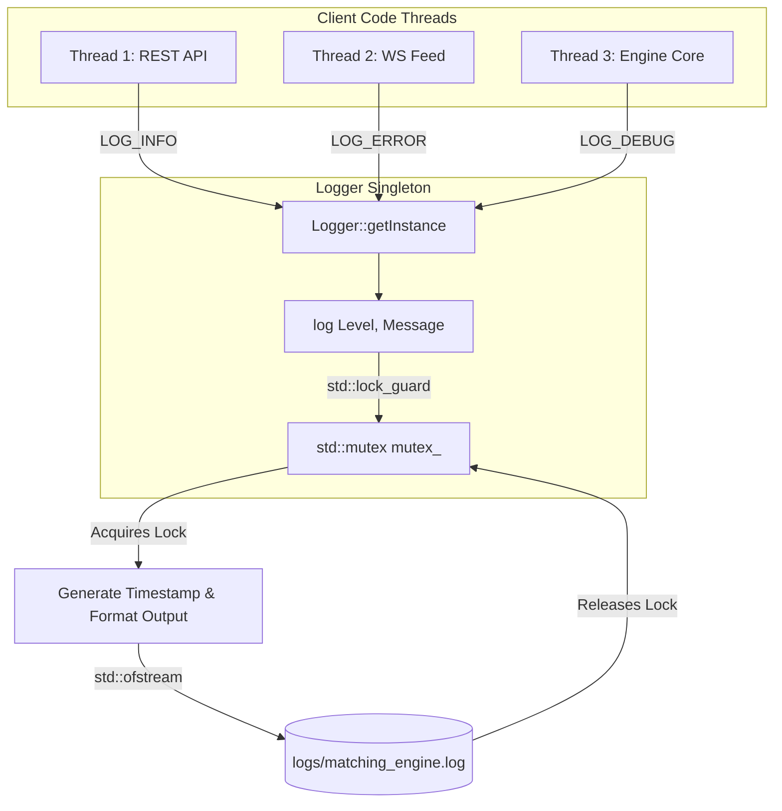

# File: src/logger.hpp

This file implements a lightweight, thread-safe stdout diagnostics logger. It ensures that logs from multiple parallel threads (e.g. WebSocket connection threads and REST request threads) are written without overlapping or corruption.

---

## What it Does

1. **Defines Log Levels**: Declares `enum class LogLevel` with values `LEVEL_DEBUG`, `LEVEL_INFO`, `LEVEL_WARN`, and `LEVEL_ERROR`.
   - *Note*: Windows headers (`wingdi.h`) define `ERROR` as a preprocessor macro (`#define ERROR 0`). Using `LEVEL_ERROR` avoids compilation failures on Windows.
2. **File Logging Output**: Creates a `logs/` folder at startup using `std::filesystem::create_directories` and opens a file stream to `logs/matching_engine.log`.
3. **Thread Safety**: Uses a `std::mutex` and a `std::lock_guard` inside the `log` function. When a thread writes a log line, it grabs the lock, blocks other logging threads, writes to the file stream, and releases it.
4. **Singleton Pattern**: Uses static initialization to implement a thread-safe Singleton instance wrapper.
5. **Timestamps**: Resolves local clocks to millisecond values and formats the output string as `YYYY-MM-DD HH:MM:SS.sss` utilizing thread-safe `gmtime_s` or `gmtime_r` operations.
5. **Macros**: Exposes utility macros (`LOG_DEBUG`, `LOG_INFO`, `LOG_WARN`, `LOG_ERROR`) to simplify usage across other files.

---

## Architectural Diagram

The diagram below shows the structural flow of a logging request:

