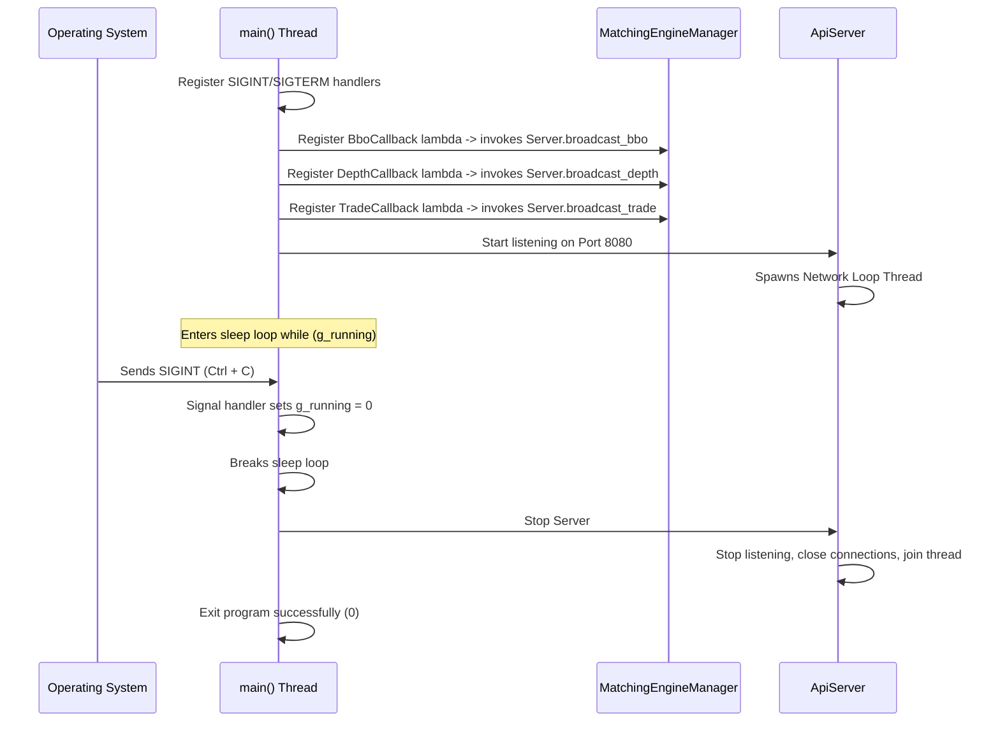

# File: src/main.cpp

This is the main entry point of the project. It coordinates initialization, registers callback delegates, launches the WebSocket/HTTP server, and gracefully handles termination signals from the operating system.

---

## What it Does

1. **Catches Termination Signals**: Registers a signal handler for `SIGINT` (Ctrl+C) and `SIGTERM`. When triggered, it flips the volatile state `g_running` flag to `0`, prompting a graceful shutdown.
2. **Wires Up Event Broadcasting**: Connects the `MatchingEngineManager` callbacks to the `ApiServer` broadcast mechanisms using lambda closures:
   - When a BBO changes, it invokes `ApiServer::broadcast_bbo`.
   - When L2 depth updates, it invokes `ApiServer::broadcast_depth`.
   - When a trade matches, it invokes `ApiServer::broadcast_trade`.
3. **Launches Networking Loops**: Starts the unified HTTP/WebSocket `ApiServer` on port `8080`.
4. **Sleep Loop**: Keeps the main thread alive using a sleep loop (`std::this_thread::sleep_for(100ms)`) checking the `g_running` flag.
5. **Graceful Cleanup**: Once terminated, it shuts down listening sockets, stops the Asio thread loop, joins the network worker threads, and releases all resources before exiting.

---

## Architectural Diagram

The diagram below shows the main thread execution and signals setup:

