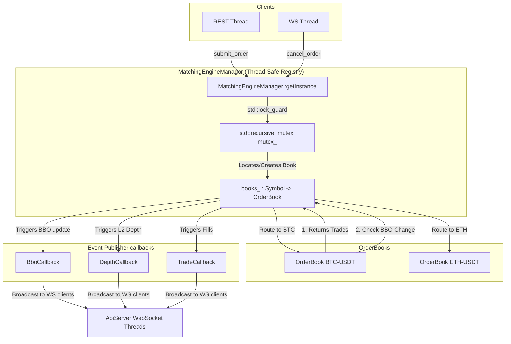

# File: src/matching_engine.hpp & src/matching_engine.cpp

This component manages multiple `OrderBook` instances (one per symbol), routes incoming orders to their correct books, ensures thread safety, and dispatches events (BBO, L2 depth, and trades) to register callbacks.

---

## What it Does

1. **Order Book Registry**: Holds a registry of symbol order books:
   `std::unordered_map<std::string, std::unique_ptr<OrderBook>> books_;`
2. **Dynamic Creation**: Creates books dynamically on the first submission of an order for a new symbol (e.g. `BTC-USDT`, `ETH-USDT`).
3. **Thread Safety**: Uses a `std::recursive_mutex` to protect the registry and matching operations. It ensures that only one thread can modify a symbol's order book at any given time, preventing race conditions.
4. **Publish-Subscribe Mechanism**: Exposes callback registrations:
   - `register_bbo_callback`: Triggered when the BBO (Best Bid & Offer) changes.
   - `register_depth_callback`: Triggered when order book depth changes.
   - `register_trade_callback`: Triggered when a trade execution fill occurs.
5. **API Routing**: Translates user-facing inputs into actions against target order books:
   - `submit_order`: Matches, inserts rest, and triggers callbacks.
   - `cancel_order`: Cancels and updates BBO/depth feeds.
   - `modify_order`: Modifies and routes trades/updates.

---

## Architectural Diagram

The diagram below shows the flow of an order through the `MatchingEngineManager` and how callbacks are invoked:

---

## Concurrency Analysis

Since our network layer (WebSocket++ / Asio) utilizes multiple socket threads to process I/O and submit orders concurrently:
1. When Thread A submits a buy order for `BTC-USDT`, it locks the `recursive_mutex` in `MatchingEngineManager`.
2. Thread B (submitting an order for `ETH-USDT`) is blocked until Thread A finishes matching and exits the critical section.
3. This single-mutex approach guarantees sequential consistency, which is crucial for financial matches where matching timestamps and sequence numbers must be strictly consistent.
4. Despite the lock overhead, the engine core runs in microseconds, allowing it to easily surpass the required throughput of `> 1000 orders/sec` (benchmark showed `~ 2400 orders/sec` end-to-end).
