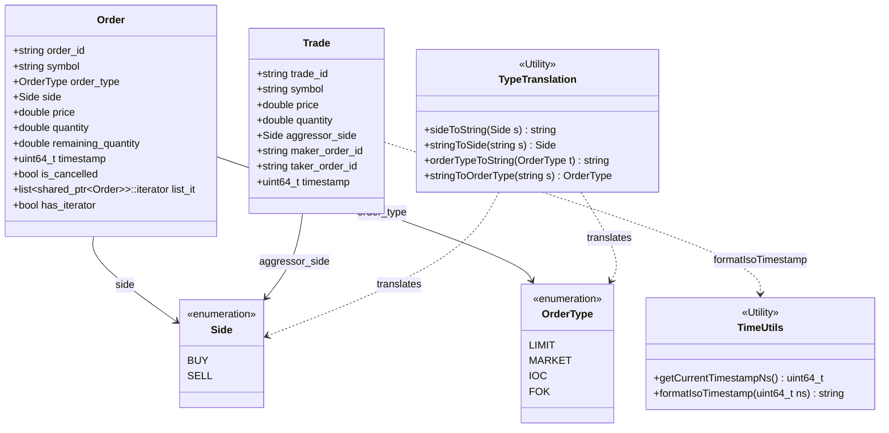

# File: src/models.hpp

This file defines the basic structures, enumerations, timestamps, and JSON serialization functions used throughout the application. It acts as the common data contract between the trading engine core, network layers, and test suites.

---

## What it Does

1. **Defines Trading Sides & Types**: Declares `enum class Side` (`BUY`, `SELL`) and `enum class OrderType` (`LIMIT`, `MARKET`, `IOC`, `FOK`).
2. **String Translations**: Implements utility translation functions (`sideToString`, `stringToSide`, `orderTypeToString`, `stringToOrderType`) to parse API strings (e.g. `"buy"`, `"limit"`) into strongly-typed C++ enums, and vice versa.
3. **Data Schemas**:
   - **`Order`**: Holds basic order inputs (`order_id`, `symbol`, `price`, `quantity`) along with engine execution states (`remaining_quantity`, `is_cancelled`). It also stores a crucial back-pointer:
     ```cpp
     std::list<std::shared_ptr<Order>>::iterator list_it;
     bool has_iterator = false;
     ```
     This iterator remembers the order's exact position in its corresponding price queue list. This allows the book to erase the order from the list in $O(1)$ time upon cancellation, eliminating linear lookups.
   - **`Trade`**: Represents an execution report containing transaction info (execution price, quantity, maker/taker order IDs, aggressor side, and timestamp).
4. **Time Utils**:
   - `getCurrentTimestampNs()`: Computes nanoseconds elapsed since epoch.
   - `formatIsoTimestamp()`: Formats nanosecond values into a safe ISO 8601 string (e.g. `YYYY-MM-DDTHH:MM:SS.ssssssZ`) utilizing thread-safe Windows `gmtime_s` or POSIX `gmtime_r` time operations.
5. **JSON Conversion**: Overloads `to_json` to convert a `Trade` structure into a `nlohmann::json` object automatically.

---

## Architectural Diagram

The diagram below shows the relationships between enums, structs, and conversion utilities:


