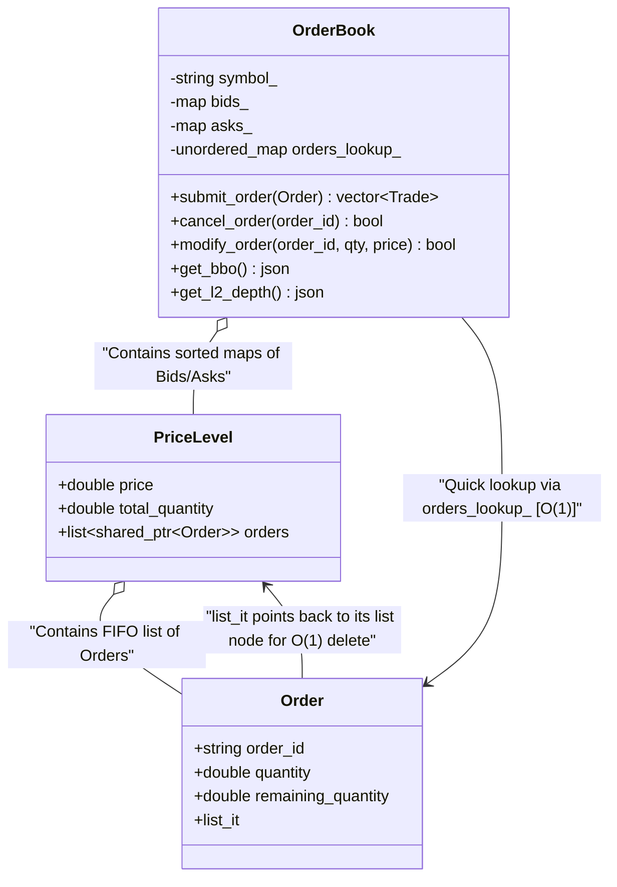
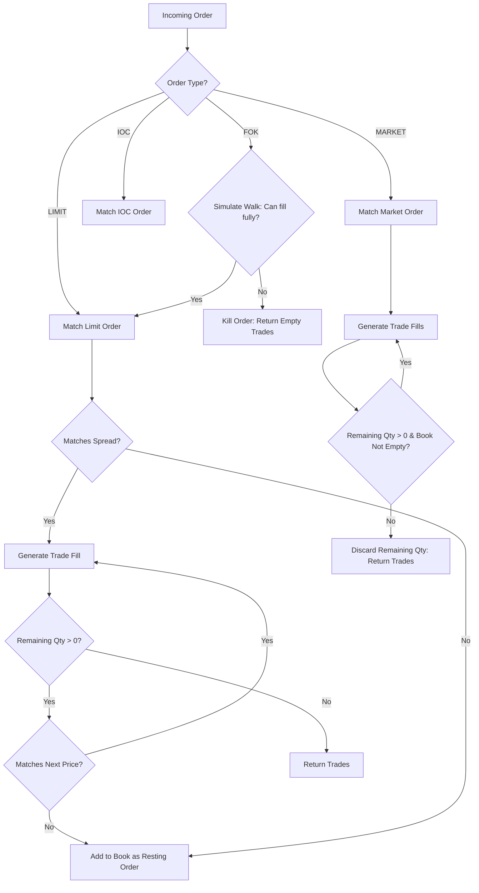

# File: src/order_book.hpp & src/order_book.cpp

This component implements the core order book data structure, price-time priority queues (FIFO), matching algorithms, order cancellations, and modification logic for a single trading pair.

---

## What it Does

1. **Represents Price Levels**:
   - **`PriceLevel`**: A structure representing a single price coordinate. It keeps a `total_quantity` sum and a double-linked list (`std::list<std::shared_ptr<Order>>`) of active orders.
   - Orders at the same price are appended to the back of the list, preserving their time of arrival (FIFO).
2. **Maintains Bid/Ask Books**:
   - `bids_`: A `std::map<double, PriceLevel, std::greater<double>>` sorted in descending order so that the highest buy price is always at the front.
   - `asks_`: A `std::map<double, PriceLevel, std::less<double>>` sorted in ascending order so that the lowest sell price is always at the front.
   - `orders_lookup_`: A hash map (`std::unordered_map<std::string, std::shared_ptr<Order>>`) mapping order IDs to the order pointers for $O(1)$ lookup speeds.
3. **Implements Matching Routines**:
   - **`match_limit_order`**: Traverses opposite side price levels. Generates trades until either the order is fully filled or the price crossing boundary is reached. If there is remaining quantity, it inserts the order into the book.
   - **`match_market_order`**: Same sweep mechanism as limit orders, but runs regardless of price until filled or the book runs empty. Remaining quantity is cancelled immediately (never rests).
   - **`match_ioc_order`**: Matches immediately up to its limit price. Any unfilled remainder is canceled.
   - **`match_fok_order`**: Performs a dry-run iteration. If the opposite side contains enough quantity to satisfy the FOK order completely, it matches. Otherwise, it cancels without executing any trades.
4. **Order Cancellation**: Uses `orders_lookup_` to find the order, sets `is_cancelled = true`, and uses the stored list iterator to delete it from the `PriceLevel` list in $O(1)$ time, maintaining accurate BBO and L2 depth calculations.
5. **Order Modification**:
   - If the price remains unchanged and the quantity decreases: Updates the quantity in-place. The order **retains** its queue priority.
   - If the price changes or quantity increases: Cancels the old order and submits a new one. The order **loses** its queue priority.

---

## Architectural Diagram

The diagram below shows how the internal maps, price levels, and order lists are structured:

---

## Execution Flow: Order Submission

